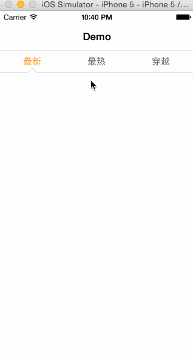

NCMenuView 神奇出品 
===========
###Info | 简介
这个控件有个问题，使用时请注意避免，箭头的线实际上长度很长，如果作为放在类似QQ侧滑框架中的容器的子视图会出现线条，那个是箭头的视图，敬请注意，暂时只支持Block回调，也可以自行添加委托。
****

****
###License | 许可
This code is distributed under the terms of the MIT License (MIT).
代码使用 MIT License (MIT) 许可发布.

The original author, NAICAI LI, reserves the right to change the license.
原作者 NAICAI LI 保留更改此许可的权力.
****

